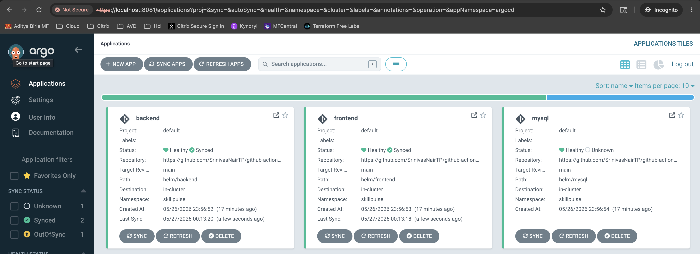
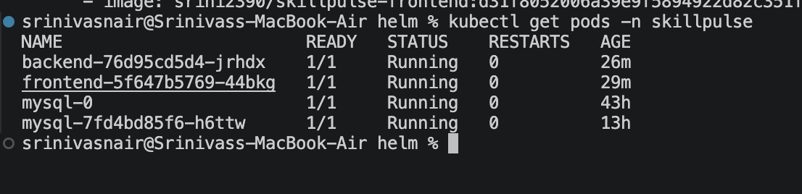
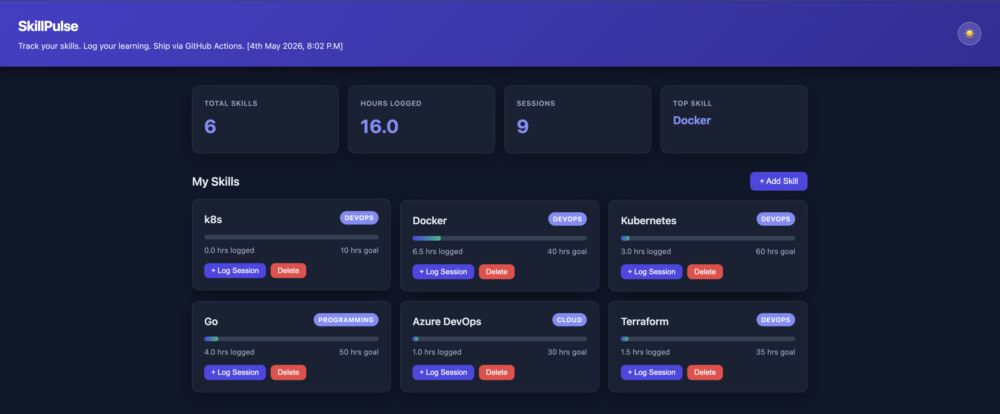
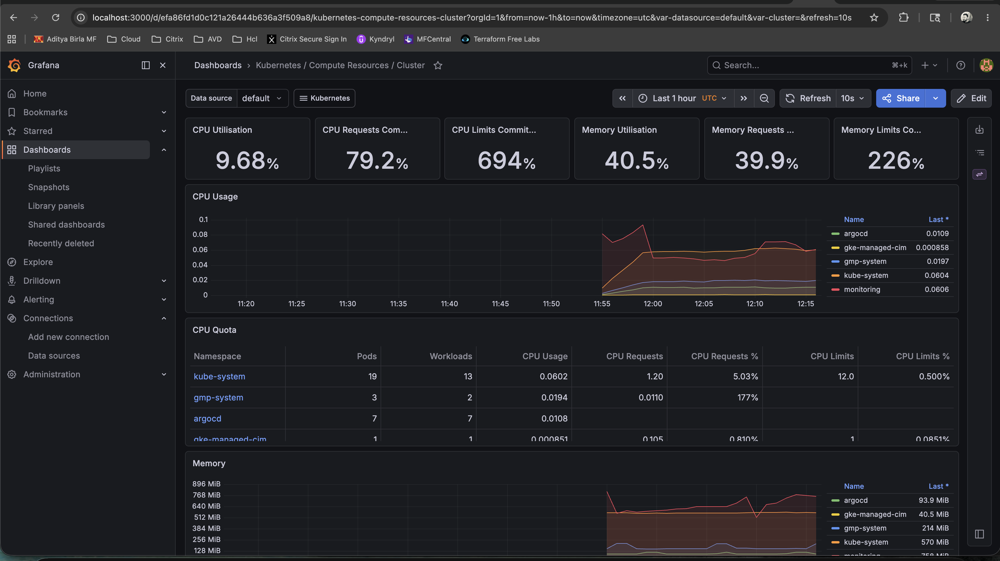

# SkillPulse – Enterprise GitOps CI/CD Platform on GKE

## Overview

SkillPulse is a cloud-native microservices application deployed on Google Kubernetes Engine (GKE) using a fully automated GitOps CI/CD workflow.

The platform demonstrates production-style Kubernetes deployment practices using:

* Kubernetes
* Helm
* ArgoCD
* GitHub Actions
* DockerHub
* GitOps workflows
* Immutable image deployments
* Monitoring and observability
* Secure container runtime practices

---

# Architecture

```text
Developer Push
      ↓
GitHub Repository
      ↓
GitHub Actions CI/CD
      ↓
DockerHub Image Registry
      ↓
Helm values.yaml Update
      ↓
ArgoCD GitOps Sync
      ↓
Google Kubernetes Engine (GKE)
      ↓
Frontend | Backend | MySQL
```

---

# Tech Stack

| Component               | Technology            |
| ----------------------- | --------------------- |
| Container Orchestration | Kubernetes (GKE)      |
| GitOps                  | ArgoCD                |
| CI/CD                   | GitHub Actions        |
| Package Management      | Helm                  |
| Container Registry      | DockerHub             |
| Backend                 | Node.js               |
| Frontend                | React                 |
| Database                | MySQL                 |
| Monitoring              | Prometheus + Grafana  |
| Cloud Platform          | Google Cloud Platform |

---

# Features

## CI/CD Automation

* Automated Docker image builds
* SHA-based immutable image tagging
* Automated Helm values updates
* GitHub Actions pipeline automation

## GitOps Deployment

* ArgoCD automated synchronization
* Declarative Kubernetes deployments
* Self-healing and pruning enabled

## Kubernetes

* Frontend, backend, and MySQL deployments
* Helm templating
* Resource requests and limits
* Liveness and readiness probes
* Secure non-root container execution

## Security

* Non-root containers
* Read-only filesystem support
* Security contexts configured
* Immutable image deployments

## Monitoring & Observability

* Prometheus metrics collection
* Grafana dashboards
* Kubernetes health monitoring

---

# CI/CD Workflow

```text
Git Push
→ GitHub Actions Build
→ Docker Image Push
→ Helm values.yaml Update
→ Git Commit Back to Repo
→ ArgoCD Detects Drift
→ Auto Sync
→ Kubernetes Rolling Deployment
```

---

# Repository Structure

```text
.
├── argocd/
├── helm/
│   ├── frontend/
│   ├── backend/
│   └── mysql/
├── frontend/
├── backend/
├── .github/workflows/
└── README.md
```

---

# Deployment Validation

Validated:

* Automatic pod redeployments
* Immutable SHA image deployments
* ArgoCD automatic sync
* GitOps workflow automation
* Kubernetes rolling updates

---

# Screenshots

## ArgoCD Dashboard




## GitHub Actions Pipeline


## Kubernetes Pods



## Application UI



## Grafana Monitoring



---

# Key Learnings

* GitOps deployment strategies
* Kubernetes troubleshooting
* Helm templating
* CI/CD automation
* Secure container runtime practices
* Production-style deployment workflows
* ArgoCD application management


---

# Future Enhancements

* Horizontal Pod Autoscaling (HPA)
* Ingress with TLS
* External Secrets Management
* Service Mesh Integration
* Multi-environment GitOps
* Blue/Green Deployments

---

# Author

Srinivas T.P.

Cloud | DevOps | Kubernetes | GitOps | Azure | Platform Engineering
